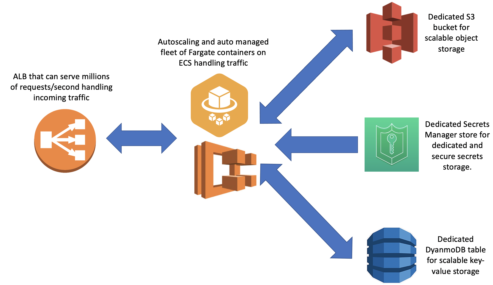
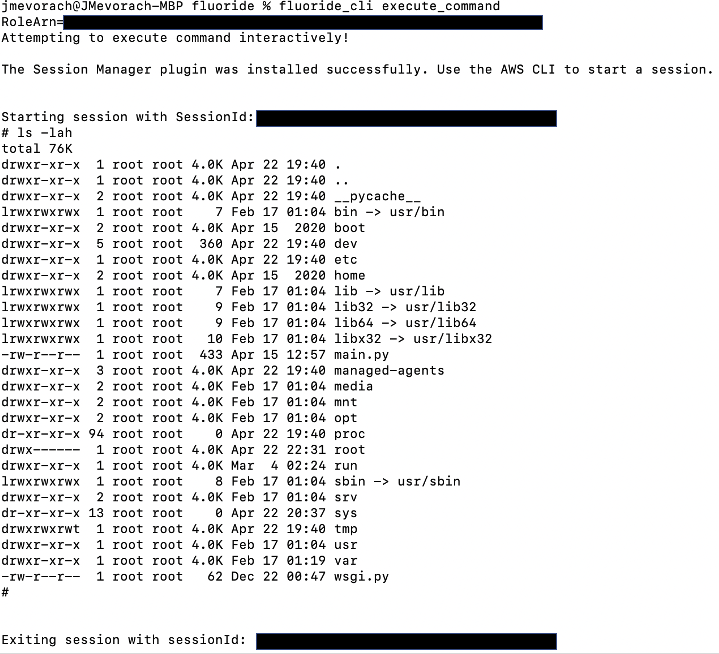
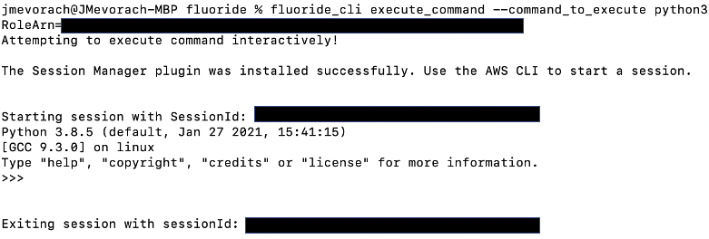
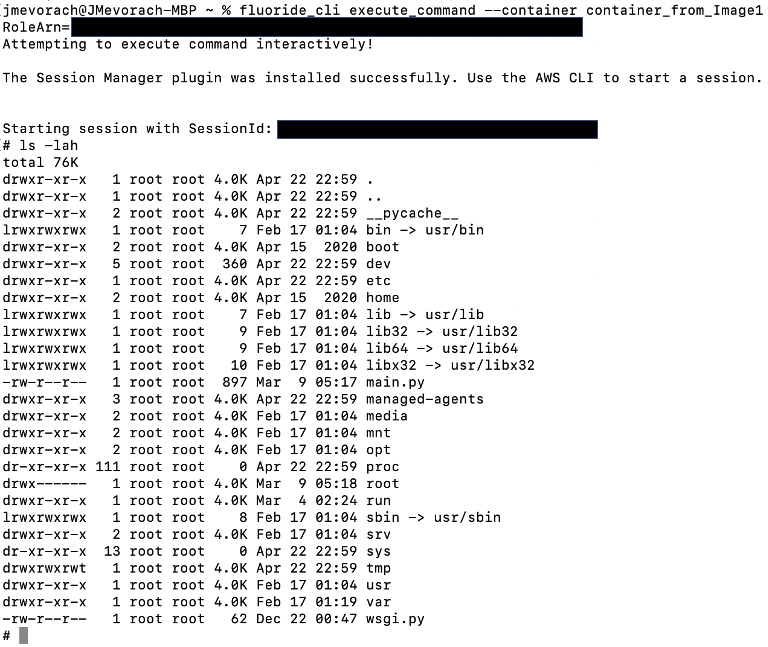
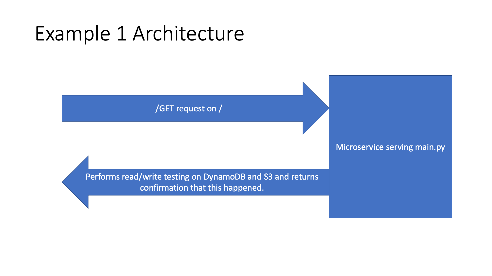
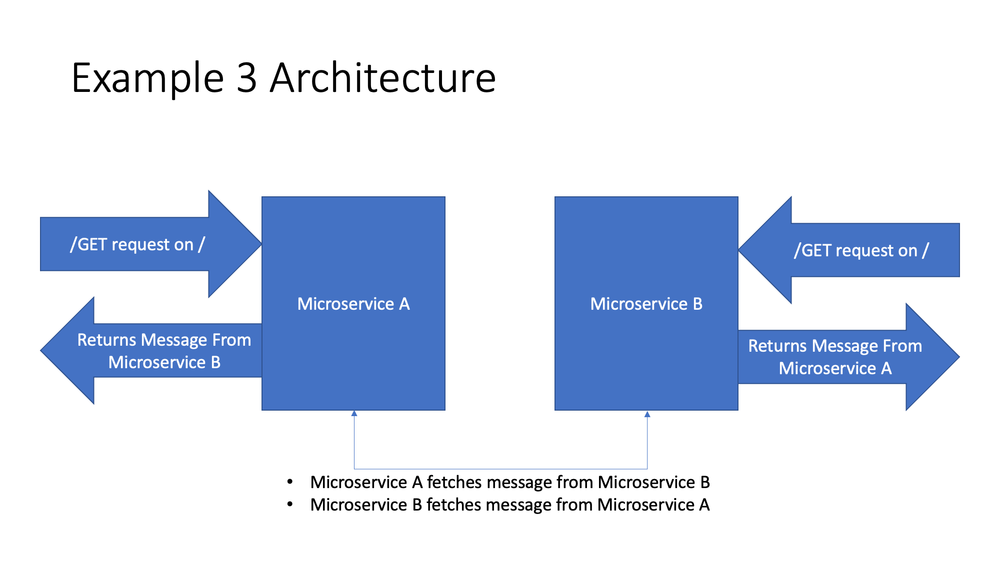
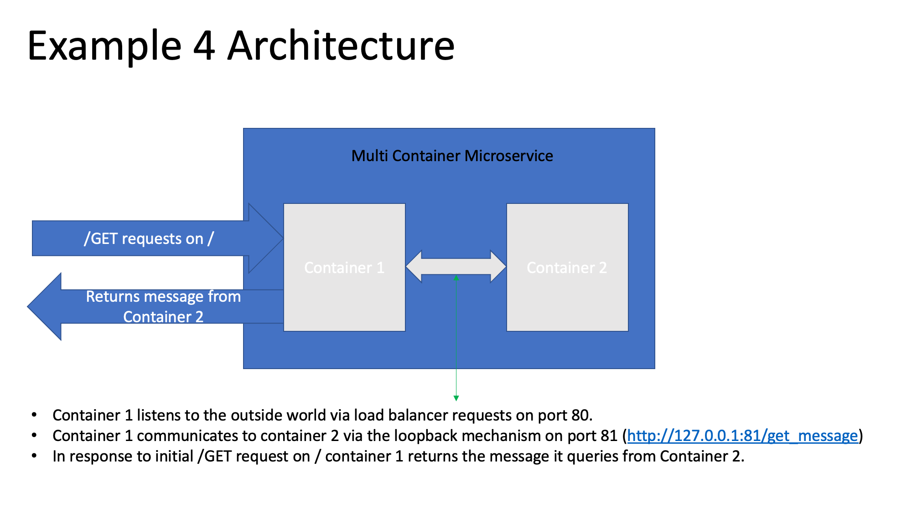

# Fluoride

MIT License

Copyright (c) 2021 Ginkgo Bioworks

## Introduction

Fluoride is a one stop shop for setting up, deploying and managing your micro services in AWS. Every part of the architecture that is Fluoride has been chosen to scale massively and perform well under load. And it should be noticed that with the usage of DNS round robins you can chain together Fluoride architectures and effectively make micro services that will scale to any size and perform well under any load. Also DNS integrations allow an easy way for Fluoride architectures to reach out and talk to one another in a scalable and performant way.

Developers of micro services frameworks have not always done the best job at making these broadly accessible to people. Fluoride wants to be as accessible as it possibly can while still being as performant as possible. To that end if you can write a container, make command line interface calls, and fill out a cloudformation template then you, the reader of this document, can set up your own highly performant and scalable micro service. We don't ask that you bring anything else to the table to get started with Fluoride.

Fluoride is a CloudFormation template and an accompanying custom made CLI. The Fluoride architecture allows for automatic, scalable and easy execution of arbitrary container code for micro services workflows.

A whole architecture can be built or deleted in under 10 minutes. You can build architectures in parallel at the same time in AWS with CloudFormation. The CloudFormation template it uses is self-contained, so it requires no external dependencies like lambda code or layers to be stored in S3 buckets.

## Project Mission


Fluoride is designed as a general microservices framework. Its purpose is to provide a framework that's easy to use, highly performant and easy to service. At the outset of the project the goal was to provide improved performance to our users while also reducing our own support burden associated with the way we currently handle micro services architectures. Also it should be noted that writing micro services in Fluoride automatically ensures a lot of best practices are followed.

## The Architecture


Filling out the Fluoride cloudformation will stand up an autoscaling Fargate cluster that will run your code and will scale up or down automatically as is needed. As long as you choose sensible hosted zones in route53 for your microservices (which you select in the template). Each service that gets stood up is a HTTP or HTTPS endpoint and you can talk to them either within a VPC or over the internet the same way you'd talk to any other API and you can chain together as many of these as you'd like both within a single account or across multiple accounts. It's economical and even during a deployment because of how the rolling deployments are managed you get zero downtime in an already up and running microservice.

It even will automatically roll back to your last deployment if the new deployment fails to result in containers that pass health checks and you can still get zero downtime in this case provided your last deployment was functional! Also there's no need for multi-container configurations for attached object storage or databases because you have an attached DynamoDB and S3 instance that you can hammer to your heart's content for scalable and performant key-value and object storage (although we do support multi-container environments and you could still do that if you wanted to). Also you have ridiculous throughput because it's an autoscaling Fargate cluster situated behind an ALB which can serve millions of request per seconds. The CLI is easy to use and with a few commands and filling out a Cloudformation template you are ready to go!

## Getting Started Guide

So you want to get started with Fluoride? Great. The process can be roughly boiled down to the following three steps.

1. Set up a route53 hosted zone (if you haven't already).
1. Write your container and deploy it to ECR (you can use the CLI for this) or docker hub.
1. Run the cloudformation YAML in the cloudformation folder in this repo.

And that's it.

## Using the CLI

### Big Picture Philosophy Behind the CLI
The whole idea with Fluoride is that the cloudformation takes care of the infrastructure and all you have to worry about is your code. To that end the CLI should take care of everything that involves deploying new code to the architecture and checking the health of your infrastructure.

### Dependencies

To use Fluoride CLI, you must install and configure the following command line tools:
- [awscli]
---> download awscli with the following command: "pip install awscli"
---> then run "aws configure" and fill out the forms the command line tool presents to you.
- [docker]
- [git]


### Installing the CLI
You can install fluoride_cli with the following steps/commands:
  * git clone https://github.com/ginkgobioworks/fluoride
  * change directory into the directory named "fluoride" that should be created when you clone this repo.
  * run `pip install -r requirements.txt`
  * run `pip install -e .`

### Uninstalling the CLI
You can uninstall fluoride_cli with the following steps/commands:
  * run `pip uninstall fluoride_cli`

### Using the CLI in Gitlab CI/CD
You can put the following six lines of code in any gitlab CI/CD job to install the Fluoride cli and use it for the rest of the job. It adds less than 20 seconds to a build step to include these lines in my experience.
```
    - git clone https://github.com/ginkgobioworks/fluoride
    - cd fluoride
    - apk add --no-cache --virtual .build-deps g++ python3-dev libffi-dev openssl-dev && apk add --no-cache --update python3 && apk add --no-cache py3-pip && pip3 install --upgrade pip
    - pip3 install -r requirements.txt --upgrade
    - pip3 install -e .
    - cd ..
```

### Configuring the AWS CLI
The CLI gets access to AWS assets by using the credentials stored in the awscli. Specifically the fluoride_cli will use your Access Keys that are configured to your awscli setup and also the default region specified in your awscli setup. This means that unless you have credentials set up for the awscli the fluoride_cli will not work. In terms of instructions on how to set up the awscli I'd like to refer you to AWS's documentation on their website here: https://docs.aws.amazon.com/cli/latest/userguide/cli-chap-configure.html.

### CLI Commands
**generate_multicontainer_cloudformation**
Allows you to generate a cloudformation template for a Fluoride architecture in which a micro service has "N" (where N is a user specified integer) containers within a single micro service.

**push_existing_image_to_ecr**
Takes a local image in docker specified as "${image_name}:${image_tag}" and pushes it to a user specified ECR repo.

**build_and_push_image_to_ecr**
Takes a specified folder containing either a "Dockerfile" or "Dockerfile.txt" (but not both) and uses the contents in that folder to build and push a workflow container to an elastic container registry.

**execute_command**
Targets a Fluoride Cloudformation stack and pulls some information from the stack which it uses to grab a Fargate container and interactively execute a command on said container. By default this command is '/bin/sh' (i.e. gives user command line access on most containers) but this command can be set to whatever you'd like. You can also target any container you'd like in a multi-container environment as it's named in the task definition (will be "container_from_ImageN" where "N" is the container specified by the ImageN parameter in the multi-container CloudFormation template).

**update_stack**
Targets a Fluoride Cloudformation stack and triggers an update. Will cause the architecture to pull the newest container for tasks from the given path/tag. It will bring up tasks with the new containers, wait for them to be healthy and then drain connections from the current tasks to the new ones. This basically is the command you can use to trigger a new deployment.

**make_ecr_repo**
Makes an ECR repo with the given name in your account. You can use ECR repos to store container code in a way that makes the container highly available for pulls. Also ECR repos will automatically version container uploads for you.

**check_health**
Targets a Fluoride Cloudformation stack and reports on the health of all of the targets (i.e. containers) in your architecture. It also returns information about the current i.p. addresses assigned to targets and other metadata.

**secretify**
Takes a path to a local folder and converts the files in that folder to base64 strings which are deployed to the secrets manager associated with your architecture. You can pull these files and secrets from secrets manager using your micro service containers.

**describe**
This takes a cloudformation stack name and will print out everything having to do with that stack name. The effect of this command is that will describe all the resources and parameters associated with your Fluoride architecture.

**check_update**
Running this command will tell you whether or not your version of fluoride_cli is the most up to date version possible. It will also auto update your cli if it find a more recent version has been released.

**configure**
Takes a name of a profile and makes a profile with attributes provided by answers to prompts provided to the user. The variables the user provides for the profile creation become defaults unless overwritten by the user and can be used to easily batch out commands without having to specify the same variables over and over again. It functions in a manner that's very similar to the "aws configure" command so if you're familiar with the awscli this should be no problem for you to use.

**check_profile**
Prints out a list of profiles with the current profile being used being underlined and attributes of the current profile printed out (if you have a profile set). If you have no profile set it will tell you that you have no profile currently set.

**delete_profile**
Deletes the profile name specified from your system.

**where_am_i**
Prints out the directory where you profile files are located. If you drag new profiles into this directory they will be automatically imported into the CLI and you can export profile files from this directory to other installations of the CLI.

**clear_profile_config**
Clears your current default profile if you have one set and makes it so you have no profile currently selected as a default.

**set_profile**
Sets a profile specified by profile name as your default profile.

**set_role**
Generates role variables and attaches them to all additional commands. Requires the use of mfa_token and serial_number arguments. Intended for use in attaching a role when using mfa to assume for every command would be inconvenient.

**release_role**
Release a role set by the set_role command.

**check_role**
Tells you if you have a role set or not. If you do it will tell you what account the new role is in and what the name of the role in said account is.

### Arguments
Usage: fluoride_cli [OPTIONS] [COMMAND]

Options:
  --account_number TEXT           The number of the AWS account you want to
                                  act on should go here.

  --use_env_variables TEXT        Even if you have a profile set you can set
                                  this flag to 'False' and the CLI will act as
                                  if you don't have a profile set allowing you
                                  to overwrite the profile variables you set.

  --role_to_assume_to_target_account TEXT
                                  This is the role you'd like to assume into
                                  in the target account to perform operations.

  --local_image_to_push TEXT      The name of a local image you'd like to push
                                  to ECR. Specify in the following manner:
                                  'image:tag'.

  --path_to_docker_folder TEXT    Path to the folder on your local machine
                                  that contains a 'Dockerfile.txt' at minimum.
                                  The script will build your container using
                                  this folder.

  --ecr_repo_to_push_to TEXT      The name of the ECR repo you'd like to push
                                  to should go here.

  --cloudformation_of_architecture TEXT
                                  The name of the cloudformation stack that
                                  contains the .

  --ecr_repo_to_make TEXT         This is the name of the ECR repo you'd like
                                  to make should go here.

  --path_to_local_secrets TEXT    A path to a local folder of secrets files
                                  you'd like deployed to secrets manager.

  --secret_store TEXT             The name of the secret manager store
                                  associated with your architecture goes here.

  --profile_name TEXT             The name of the profile you'd like to act on
                                  goes here.

  --output_path TEXT              The path (including filename) where you'd
                                  like to put the cloudformation generated by
                                  the generate_multicontainer_cloudformation
                                  command.

  --number_of_images TEXT         The number of images(containers) you'd like
                                  the cloudformation generated by the
                                  generate_multicontainer_cloudformation
                                  command to accomodate.

  --dont_assume TEXT              Set this flag to True to not assume role to
                                  use a command. If you've set a role or your
                                  working in the root account this would make
                                  sense to do. Allowed values are "True" or
                                  "False".

  --mfa_token TEXT                You can use this flag with any command that
                                  requires the
                                  'role_to_assume_to_target_account' variables
                                  to provide an mfa token from an mfa device
                                  for use with assuming role.

  --serial_number TEXT            Set this flag whenever you use set the
                                  mfa_token flag. This should be the ARN of
                                  the mfa device you're using to generate a
                                  token.

  --container TEXT                Optional flag used to specify a container
                                  for the "execute_command" command. This flag
                                  indicates the optional name of the container
                                  to execute the command on. A container name
                                  only needs to be specified for tasks
                                  containing multiple containers.

  --command_to_execute TEXT       Optional flag used to specify a command for
                                  the "execute_command" command. By default
                                  this command is "/bin/sh" but you can
                                  overwrite it to be whatever you would like
                                  it to be.

  --help                          Show this message and exit.

### Interactive Sessions
Using the fluoride_cli you can start interactive sessions on your containers for debugging purposes using the "execute_command" command.

With this feature you can interactively execute '/bin/sh' on a container in a single container environment as seen below.



You can also change the default command that gets interactively executed to be whatever you'd like as seen below.



And you can also interactively execute sessions on specific containers in multi container environments by specifying the name of the container you'd like to execute against. In Fluoride multi-container environments containers are named "container_from_ImageN" where "N" is the container specified by the ImageN parameter in the multi-container CloudFormation template.



### Using List Arguments With the CLI
Sometimes you want to easily manage a multi-container micro service in Fluoride. Rather than having to make multiple CLI calls with different arguments each time to do this we wanted to make it so that relevant commands could iterate through list type inputs and manage as many containers as you'd want. To this end

The following commands can work with list based inputs.

**push_existing_image_to_ecr**

**build_and_push_image_to_ecr**

**make_ecr_repo**

The following inputs for those commands can, instead of just being a normal valid string input, can be a space separated list of valid string inputs.

**local_image_to_push**

**path_to_docker_folder**

**ecr_repo_to_push_to**

**ecr_repo_to_make**

If you choose to make one of these inputs a list the other potential list inputs must match in length. That's to say if I specify a list to **push_existing_image_to_ecr** for **local_image_to_push** that's a space separated list of two items then the other potential list based input that function requires **ecr_repo_to_push_to** must be a space separated list with two items in it as well. The first image in the list given for **local_image_to_push** will be pushed to the first ECR repo in the list given for **ecr_repo_to_push_to** and so on and so on.

You can also use these functions without lists should you want as well and they'll work normally that was as well the same way any of the other functions work.

### Configuring the AWS CLI
The CLI gets access to AWS assets by using the credentials stored in the awscli. Specifically the fluoride_cli will use your Access Keys that are configured to your awscli setup and also the default region specified in your awscli setup. This means that unless you have credentials set up for the awscli the fluoride_cli will not work. In terms of instructions on how to set up the awscli I'd like to refer you to AWS's documentation on their website here: https://docs.aws.amazon.com/cli/latest/userguide/cli-chap-configure.html.

### Profiles as a Concept
A profile is a collection of default variables with a given name. The idea is that each profile should represent an architecture you're managing so that if you're in the profile named "project_A" and you type "fluoride_cli build_and_push_image_to_ecr && fluoride_cli update_stack" you will build and push the latest code for project_A and deploy it (with zero downtime!). If you're in the profile named "project_B" and you type "fluoride_cli build_and_push_image_to_ecr && fluoride_cli update_stack" you will build and push the latest code for project_B and deploy it (with zero downtime!).

### Importing Profiles
The where_am_i command prints out the directory where you profile files are located. If you drag new profiles into this directory they will be automatically imported into the CLI and you can export profile files from this directory to other installations of the CLI. You can study the composition of profile files created by the CLI in this directory to see how they're configured but they're basically just json blobs that specify variables provided by the user.

### Assuming Role and Using the Fluoride CLI
Assuming role is a concept you should be aware of when using the Fluoride CLI. It's sort of a concept that underpins a lot of the operation of the tool.

Basically the way many AWS environments are set up is that you'd have real AWS IAM accounts located in a root account and everything else you do in any other account that's part of the same organization is done via a role. This in-general is known as a "multi-account strategy" in AWS speak because you have one root account that contains peoples IAM accounts and every other account is accessed via roles that the IAM accounts have permissions to assume. A role is basically a certain collection of permissions and when you "assume" a role you gain access to the permissions that role describes (they're all basically a collection of JSONs that say what you can and can't do in an AWS account).

The Fluoride CLI is designed to be able to operate in all AWS environments and to do this securely it borrows the credentials stored in the official AWS CLI you should have co-installed on a computer where you're using the CLI. If you have the AWS CLI installed and you run "aws configure" it's going to ask you to put in an "AWS Access Key ID" and "AWS Secret Access Key" (and a default region you'd want to operate in for commands which you should fill out) (here's official documentation on how to configure the CLI from AWS themselves: https://docs.aws.amazon.com/cli/latest/userguide/cli-chap-configure.html).

All that Fluoride CLI does on the back end is use boto3 and the aws cli both of which share the same credentials. Fluoride CLI will try to assume role into another account if you have the aws CLI configured with credentials set up for one account and you ask it to try to do something in another account. Fluoride CLI comes with a bunch of different ways to interact with roles so you can use it in pretty much any way you'd realistically need/want to. While fluoride_cli by default assumes a multi-account strategy for much of its defaults it can work with pretty much any account setup and I'd like to go through all the different ways you can work with roles so you can see all the different ways you can alter how you approach usage of the fluoride_cli to make it work with however you have your accounts setup.

#### Assuming Role Without Using MFA
  * __Why Would You Do This?__ If you have your AWS CLI set up to use your account credentials in the root account and you want to assume role into another account and your credentials don't require you to use MFA (multi factor authentication) to do this.
  * __How Would You Do This?__ If you do not specify the --mfa_token, --serial_number, or --dont_assume (by default it is set to False) flags Fluoride_CLI will by default try to assume role into another account should it need to using the role specified by the --role_to_assume_to_target_account flag.

#### Assuming Role Using MFA
  * __Why Would You Do This?__ If you have your AWS CLI set up to use your account credentials in the root account and you want to assume role into another account and your credentials require you to use MFA (multi factor authentication) to do this.
  * __How Would You Do This?__ If you specify the --mfa_token flag and the --serial_number flag and don't specify the --dont_assume flag (by default it is set to False) Fluoride will try to assume role into another account should it need to using the role specified by the  --role_to_assume_to_target_account flag and will use the mfa_token specified by the --mfa_token flag and the mfa device ARN specified by the --serial_number flag to do so.

#### Using an Instance Attached Role
  * __Why Would You Do This?__ If you are running fluoride_cli in an EC2 instance with a role attached with the permissions you need for that account and don't need to assume into another role to access resources in that account. So in this scenario you're in the account your architecture is in and you have a role attached to your EC2 instance that allows you to access all the resources within that architecture.
  * __How Would You Do This?__ If you set the --dont_assume flag to True the fluoride_cli will use the credentials encoded by the aws CLI as environment variables to perform operations without the need to assume role. If you attach a role to an EC2 instance these environment variables I mentioned are configured for you automatically.

#### Assuming Role Via the Fluoride CLI
  * __Why Would You Do This?__ A whole bunch of reasons. The most likely one I can think of is you have account credentials that require you to use multi factor authentication to assume role and you want to batch out a bunch of commands and don't want to have to enter in a new mfa token each time you do this (i.e. you want to batch out 30 jobs and don't want to type in 30 different mfa tokens to make that happen).
  * __How Would You Do This?__ Attach role variables to fluoride_cli using the set_role command. You can verify that the command worked correctly using the check_role command. When the role credentials expire due to time or you're done using them you can release them and detatch the role from fluoride_cli using the release_role command.

## Some Example Code

### Example 1 (testing_code/permissions_testing)


### Example 2 (testing_code/rickroll)


### Example 3 (testing_code/MicroserviceA & testing_code/MicroserviceB)


### Example 4 (testing_code/multi_container_demo)


## Helpful Environment Variables
The following environment variables are encoded automatically for you in all of your containers and can be used to help generalize and more easily write useful code that interfaces with other part of your architecture.
  * __fluoride_dynamodb_table_ttl_key__ - The TTL key for the DynamoDB for your architecture.
  * __fluoride_dynamodb_table_primary_key__ - The primary key for the DyanmoDB for your architecture.
  * __fluoride_dynamodb_table__ - A path to a DynamoDB table your containers can read and write to.
  * __fluoride_s3_bucket__ - The name of a S3 bucket that your containers can read and write to.
  * __fluoride_secrets_manager__ - The name of a secrets manager store your containers have permissions to read from.
  * __fluoride_architecture_region__ - This is the AWS region that your architecture exists in.
  * __fluoride_architecture_account_id__ - This is the AWS account I.D. that your architecture exists in.
